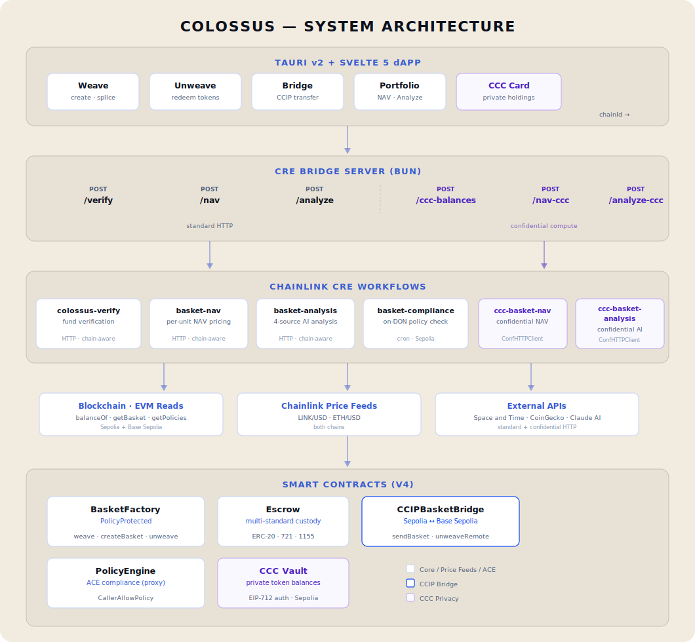

# Colossus — Universal Asset Baskets

**On-Chain Securitization Powered by Chainlink CRE · CCIP · ACE · CCC**

*Weave any combination of ERC-20, ERC-721, and ERC-1155 tokens into a single, transferable, cross-chain basket token — then bridge, verify, and redeem anywhere.*

***Anything that can be tokenized can be put in the basket.***

Built for the [Chainlink CONVERGENCE CRE](https://hack.chain.link) hackathon.

---

> ⚠️ **Disclaimer**: This project was developed as a hackathon proof of concept with significant AI assistance (Claude, Anthropic). The smart contracts and application code have **not been audited** and should **not be deployed to mainnet or used in production** without thorough peer review, security audits, and legal compliance assessment. All deployments are on testnets (Sepolia + Base Sepolia). Use at your own risk.

---

## 📖 Deep Dives

For the full project context beyond this README, see the `docs/` folder:

| Document                                                 | What's Inside                                                                                                |
| -------------------------------------------------------- | ------------------------------------------------------------------------------------------------------------ |
| **[Pitch Deck](docs/pitch-deck.md)**                     | Vision, "why this exists," CRE/CCIP/ACE/CCC integration details, scaling strategy, fee model                 |
| **[Competitive Analysis](docs/competitive-analysis.md)** | Landscape assessment vs. Index Coop, SoSoValue, Enzyme, Balancer, Ondo, Centrifuge — and where Colossus fits |

---

## What Is Colossus?

Securitization is how Wall Street packages mortgages, CDOs, receivables, and other assets into standardized tradeable units. Rating agencies verify. Intermediaries distribute. Settlement takes days.

Colossus does the same thing on-chain:

| Traditional Finance | Colossus |
|---|---|
| Rating agencies (Moody's, S&P) verify | **Chainlink DONs** verify via CRE workflows |
| Intermediaries distribute | **CCIP** bridges baskets cross-chain |
| Compliance officers gate access | **ACE PolicyEngine** enforces on-chain |
| Portfolio contents are private | **CCC** vault shields holdings + **ConfidentialHTTPClient** shields workflow execution |
| Settlement takes days | Settlement in **minutes** |

Every basket unit is **fully backed 1:1** by escrowed tokens. The escrow always holds exactly `totalSupply × amountPerUnit` for each component. No fractional reserve, no manager discretion.
For a detailed breakdown of how basket value works — including why new issuance doesn't dilute existing holders — see [How Basket Value Works](docs/How-Basket-Value-Works.md).

---

## Architecture



---

## The Full Chainlink Stack

Colossus integrates every layer of Chainlink's infrastructure:

| Chainlink Service | Colossus Usage |
|---|---|
| **CRE** | 6 workflows — fund verification, NAV pricing, AI analysis, compliance checking + 2 confidential variants (ConfidentialHTTPClient) |
| **CCIP** | Cross-chain basket bridging (Sepolia ↔ Base Sepolia) |
| **ACE** | PolicyEngine with CallerAllowPolicy on `weave()` + `createBasket()` |
| **CCC** | Private token vault (EIP-712 auth) + ConfidentialHTTPClient workflows for confidential external API calls |
| **Price Feeds** | LINK/USD + ETH/USD on both chains for NAV calculation |
| **Data Feeds** | Space and Time integration for mainnet analytics at scale |

---

## CRE Workflows

Six workflows total — four standard (HTTPClient) and two confidential (ConfidentialHTTPClient). All HTTP-triggered workflows are chain-aware and work on both Sepolia and Base Sepolia.

### 1. `colossus-verify` — Pre-Weave Fund Verification
The DON independently reads on-chain balances and confirms the user holds sufficient tokens before weaving. A spoofed frontend cannot trick the protocol. HTTP trigger, chain-aware, works on both Sepolia and Base Sepolia.

### 2. `basket-nav` — Per-Unit NAV Calculation
Reads basket components from BasketFactory, prices each via Chainlink price feeds, returns per-unit NAV in USD. Browser and DON parity — same feeds, same math, trustless verification. HTTP trigger, chain-aware.

### 3. `basket-analysis` — AI-Powered Portfolio Analysis
Orchestrates four heterogeneous data sources in a single CRE execution: blockchain reads → Space and Time analytics → CoinGecko market data → Claude AI analysis. HTTP trigger, chain-aware, ~42 second execution.

### 4. `basket-compliance` — On-DON Policy Verification
Four sequential on-chain reads: basket existence → PolicyEngine address → attached policies → per-wallet authorization. The decentralized equivalent of a compliance officer reviewing a trade before execution. Cron trigger, Sepolia.

### 5. `ccc-basket-nav` — Confidential NAV Calculation
Same NAV computation as `basket-nav`, but external API calls route through CRE's `ConfidentialHTTPClient`. API keys are injected via secret templates (`{{.keyName}}`) and never leave the enclave. Demonstrates the CRE → CCC upgrade path with minimal code changes. HTTP trigger, chain-aware.

### 6. `ccc-basket-analysis` — Confidential AI Analysis
Same multi-source analysis as `basket-analysis`, but CoinGecko and Claude API calls route through `ConfidentialHTTPClient`. SXT is excluded due to a ~30s hard timeout on the confidential HTTP capability. Gracefully degrades from 4 to 3 data sources (blockchain + CoinGecko + Claude). HTTP trigger, chain-aware, ~30s execution.

---

## Deployed Contracts (Testnet)

### Sepolia

| Contract | Address |
|---|---|
| PolicyEngine (proxy) | `0xcF3E8B18Cd9659f8261b175caF802ABb94ed5F03` |
| BasketFactory | `0x885eC430c471a74078C7461Fd9F44D32cB019d3D` |
| Escrow | `0x08906403F95bDaa81327D1F28d3C5EC5d1DDA686` |
| CCIPBasketBridge | `0xC81b80bc1B1047DDEd6AE86Dca1EB1945eee1051` |
| CallerAllowPolicy | `0x7B76139EF566291Dae2AbE03494Dbe9b38bFA2Fd` |
| CCC Vault* | `0xE588a6c73933BFD66Af9b4A07d48bcE59c0D2d13` |

*\*Shared infrastructure from Chainlink's Compliant Private Token Demo — Sepolia only.*

### Base Sepolia

| Contract | Address |
|---|---|
| PolicyEngine (proxy) | `0xb6C521FBbf65Db19f92c05eE5b1021b7f915E077` |
| BasketFactory | `0xcf26e052aa417cEb1641e8B7eA806F388Cc9a022` |
| Escrow | `0xF1F02bA1CcaFAFf26a9e872d2157a054125f6Bd5` |
| CCIPBasketBridge | `0xff4bbE0428398012D96C2D70385a9bFf421d43Ff` |
| CallerAllowPolicy | `0x84DDa2BA2D7dEDE735BF8f12Cf88451F5c6b5738` |

All 8 contracts verified on Etherscan/Basescan (V2 API).

---

## Tech Stack

| Layer | Technology |
|---|---|
| **Frontend** | Tauri v2 + Svelte 5 (runes) |
| **Wallet** | viem + wagmi, WalletConnect (Tauri) + MetaMask (browser) |
| **Contracts** | Solidity 0.8.28, Foundry, `via_ir` optimization |
| **Compliance** | Chainlink ACE PolicyEngine (V4, both chains) |
| **Privacy** | Chainlink CCC vault (EIP-712 auth) + ConfidentialHTTPClient workflows |
| **CRE** | TypeScript SDK v1.1.1, Bun runtime, 6 workflows (4 standard + 2 confidential) |
| **Bridge Server** | Bun HTTP, 6 endpoints (verify, nav, analyze, ccc-balances, nav-ccc, analyze-ccc), chain-aware routing |
| **Chains** | Ethereum Sepolia + Base Sepolia |
| **External APIs** | Space and Time, CoinGecko, Claude (Anthropic) |

---

## Project Structure

```
Colossus/
├── contracts/                    # Foundry project (Solidity 0.8.28)
│   ├── src/
│   │   ├── BasketFactory.sol     # V4 — PolicyProtected, runPolicy on weave/createBasket
│   │   ├── Escrow.sol            # Multi-standard custody (ERC-20/721/1155)
│   │   ├── CCIPBasketBridge.sol  # CCIP bridging (Sepolia ↔ Base Sepolia)
│   │   └── CallerAllowPolicy.sol # ACE allowlist policy
│   ├── script/Deploy.s.sol       # V4 deployment script
│   ├── lib/                      # Git submodules (chainlink-ace, OZ, ccip, forge-std)
│   └── foundry.toml
│
├── src/                          # Tauri + Svelte frontend
│   ├── App.svelte                # Main UI — all tabs, CRE buttons, CCC card
│   └── lib/
│       ├── wallet.ts             # WalletConnect + public/wallet client
│       ├── colossus.ts           # Contract interactions (weave, unweave, bridge)
│       ├── contracts.ts          # V4 contract addresses (both chains)
│       ├── abis.ts               # ABI definitions
│       ├── clients.ts            # Multi-chain read-only public clients
│       ├── priceFeed.ts          # Chainlink price feed reads + fee calculation
│       └── ccc.ts                # CCC vault EIP-712 balance fetch
│
├── src-tauri/                    # Tauri v2 backend (Rust)
│
├── workflows/cre/                # CRE project
│   ├── project.yaml              # RPC config (Sepolia + Base Sepolia)
│   ├── secrets.yaml              # Maps logical secret IDs → env var names (DO NOT COMMIT)
│   ├── colossus-verify/main.ts   # Fund verification — HTTP trigger, chain-aware
│   ├── basket-nav/main.ts        # NAV calculation — HTTP trigger, chain-aware
│   ├── basket-analysis/main.ts   # 4-source analysis — HTTP trigger, chain-aware
│   ├── basket-compliance/main.ts # Policy verification — cron trigger
│   ├── ccc-basket-nav/main.ts    # Confidential NAV — ConfidentialHTTPClient
│   └── ccc-basket-analysis/main.ts # Confidential AI analysis — ConfidentialHTTPClient
│
├── cre-bridge.ts                 # Local HTTP bridge: dApp → CRE simulate + CCC proxy (6 endpoints)
│
├── docs/                         # Project documentation
│   ├── pitch-deck.md             # Vision, integration details, scaling
│   ├── competitive-analysis.md   # Landscape vs. competitors
│   ├── architecture.svg          # System architecture diagram
│   └── How-Basket-Value-Works.md # 1:1 backing, NAV, no-dilution explainer
│
├── .gitignore
├── package.json
├── vite.config.ts
└── README.md                     # ← You are here
```

---

## Local Development Setup

### Prerequisites

- [Bun](https://bun.sh) (runtime + package manager)
- [Foundry](https://book.getfoundry.sh/getting-started/installation) (`forge`, `cast`)
- [Rust](https://rustup.rs/) (for Tauri v2)
- Node.js 18+ (for Tauri CLI)

### 1. Install Dependencies
```bash
cd Colossus
bun install
cd contracts
forge install   # pulls git submodules (chainlink-ace, OZ, ccip, forge-std)
forge build --skip test
```

> **Note:** The CCIP submodule path may require remapping for local builds.
> All V4 contracts are deployed and verified on Sepolia and Base Sepolia.

### 2. Environment Files

Create the following `.env` files (not committed — see `.gitignore`):

**`contracts/.env`**:
```
PRIVATE_KEY=<your-testnet-private-key>
RPC_SEPOLIA=<alchemy-or-infura-sepolia-rpc>
RPC_BASE_SEPOLIA=<base-sepolia-rpc>
ETHERSCAN_API_KEY=<etherscan-v2-api-key>
```

**`workflows/cre/.env`**:
```
SXT_API_KEY=<space-and-time-api-key>
LLM_API_KEY=<anthropic-api-key>
```

### 3. Run the Application

```bash
# Terminal 1 — CRE bridge server
cd Colossus
bun run cre-bridge.ts

# Terminal 2 — Tauri dev server
cd Colossus
bun run tauri dev
```

The CRE bridge runs on `http://localhost:3456`. The Tauri app spawns with hot-reload.

### 4. CRE Workflow Simulation (standalone)

```bash
cd workflows/cre

# Fund verification
cre workflow simulate colossus-verify --non-interactive --trigger-index 0 \
  --http-payload '{"userAddress":"<addr>","tokenAddresses":["<token>"],"amounts":["<wei>"],"units":1}' \
  --target staging-settings

# NAV calculation
cre workflow simulate basket-nav --non-interactive --trigger-index 0 \
  --http-payload '{"basketId":"<BASKET_ID>"}' \
  --target staging-settings

# Portfolio analysis (4 data sources, ~42s)
cre workflow simulate basket-analysis --non-interactive --trigger-index 0 \
  --http-payload '{"basketId":"<BASKET_ID>"}' \
  --target staging-settings

# Compliance check
cre workflow simulate basket-compliance --target staging-settings -v

# Confidential NAV (ConfidentialHTTPClient)
cre workflow simulate ccc-basket-nav --non-interactive --trigger-index 0 \
  --http-payload '{"basketId":"<BASKET_ID>"}' \
  --target staging-settings

# Confidential AI analysis (ConfidentialHTTPClient, ~30s)
cre workflow simulate ccc-basket-analysis --non-interactive --trigger-index 0 \
  --http-payload '{"basketId":"<BASKET_ID>"}' \
  --target staging-settings
```

---

## Demo Baskets (Testnet)

| Basket                | ID  | Chain        | Components           | Units | Purpose                   |
| --------------------- | --- | ------------ | -------------------- | ----- | ------------------------- |
| [CRE_HACKATHON_DEMO](https://sepolia.etherscan.io/nft/0x885eC430c471a74078C7461Fd9F44D32cB019d3D/5)    | 5   | Sepolia      | 7 LINK + 0.0042 WETH | 7     | CRE workflows + ACE demo  |
| [CCIP_BnM_DEMO](https://sepolia.etherscan.io/nft/0x885eC430c471a74078C7461Fd9F44D32cB019d3D/6)         | 6   | Sepolia      | 1 CCIP-BnM           | 3     | Cross-chain bridging demo |
| [BASE_CONVERGENCE_DEMO](https://sepolia.basescan.org/nft/0xcf26e052aa417ceb1641e8b7ea806f388cc9a022/3) | 3   | Base Sepolia | 7 LINK (Base)        | 2     | Multi-chain CRE demo      |

---

## License

© 2026 Arkh LLC. All rights reserved. This code is shared for educational and demonstration purposes. No commercial use, modification, or redistribution without written permission.

---

## Acknowledgments

Built for the Chainlink CRE Convergence hackathon. Thank you to the Chainlink team for the opportunity — building at the intersection of DeFi infrastructure and traditional securitization has been a tremendous learning experience.

Chainlink services used: CRE, CCIP, ACE, CCC, Price Feeds, Space and Time integration.
